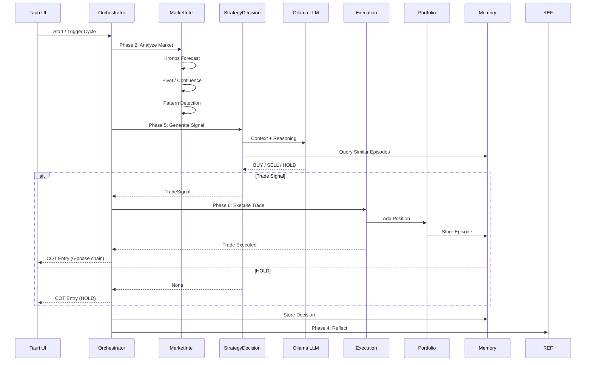
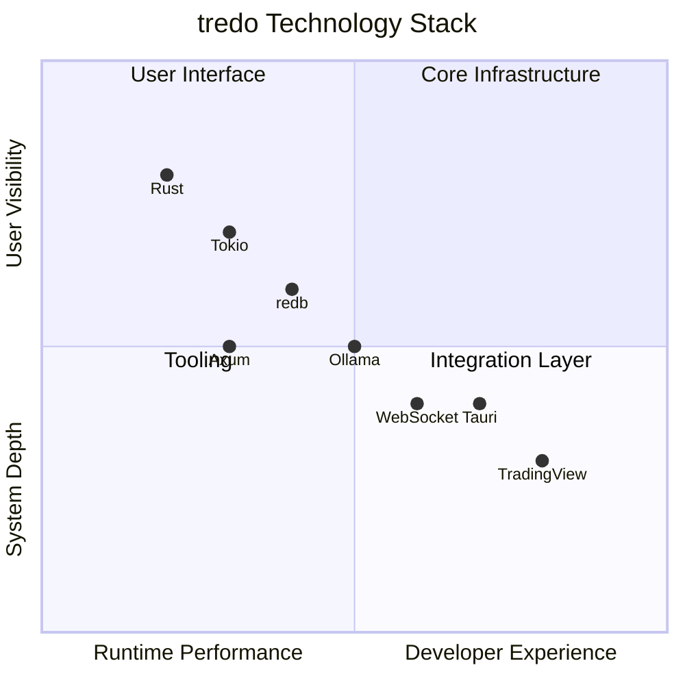

# ⚡ tredo — Trading Real-time Edge Decision Optimisation

> **Production-grade, Rust-first hierarchical multi-agent trading co-pilot** with a beautiful full **Terminal UI**. Enforces a rigorous **Disciplined Core** of professional trading rules while incorporating memory-driven learning, multi-agent debate, and selective LLM orchestration. Paper trading only until perfect.

[](https://www.rust-lang.org)
[](https://tokio.rs)
[](https://tauri.app)
[](LICENSE)

---

## 🏛️ System Architecture

```mermaid
graph TB
    subgraph "UI Layer [Full Terminal UI (primary) + Tauri (secondary)]"
        T[tredo Terminal UI (ratatui)]
        COT[Chain-of-Thought\nLive Log]
        DASH[Dashboard\nPortfolio + P&L]
        TRAD[Watchlist + Decisions]
    end

    subgraph "Orchestration Layer [tredo-orchestrator]"
        FAST[Fast Loop\n5s: Price + SL/TP]
        MED[Medium Loop\n5m: Full Pipeline]
        SLOW[Slow Loop\n24h: Reflection]
        ORCH[AutonomousOrchestrator]
    end

    subgraph "Agent Layer (Tredo Groups) [tredo-autonomous]"
        subgraph "Identifier [Scanning & Context]"
            MI[MarketIntelligenceAgent]
            WS[WatchlistScannerAgent]
            PC[PivotCalculatorAgent]
            CS[ConfluenceScorerAgent]
            PR[PatternRetrieverAgent]
            ST[SessionTimerAgent]
            RFC[RedFolderCheckerAgent]
        end

        subgraph "Verifier [Risk & Psych Validation]"
            RP[RiskPsychologyAgent]
            RC[RiskCalculatorAgent]
            REF[ReflectorAgent]
        end

        subgraph "Executer [Trade Generation]"
            SD[StrategyDecisionAgent]
            PM[PortfolioManagerAgent]
            EXEC[ExecutionCoordinatorAgent]
        end

        subgraph "Guardian [Account Safeguards]"
            DM[DrawdownMonitorAgent]
            OP[OvertradingPreventerAgent]
            OL[OutcomeLoggerAgent]
        end
        MC[MetaControlAgent\nRule Adjustment]
    end

    subgraph "Core Layer [tredo-core]"
        DC[DisciplinedCore\nRule Enforcement]
        MEM[Memory Store\nredb + Vector Memory]
        LLM[LLM Executor\nOllama Integration]
        KRON[Kronos Client\nForecast Service]
        PAT[Candlestick Patterns\n15 Detectors]
    end

    subgraph "External Services"
        BINANCE[Binance WebSocket\nCrypto Prices]
        YAHOO[Yahoo Finance\nIndian Stocks]
        OLLAMA[Ollama LLM\nministral-3]
        KRONSVC[Kronos Service\nTime Series Forecast]
        TV[TradingView\nChart Widget]
    end

    T --> ORCH
    ORCH --> FAST & MED & SLOW
    FAST --> BINANCE & YAHOO
    MED --> MI & SD & RP
    SLOW --> REF & MC
    
    MI --> PC & CS & ST & PAT
    SD --> LLM & PR
    RP --> DM & RFC & OP
    PM --> MEM
    EXEC --> DC
    MC --> DC
    
    KRON --> KRONSVC
    LLM --> OLLAMA
    T --> TV
    T --> COT & DASH & TRAD & AI
    COT --> ORCH
```

---

## 🧭 Data Flow



---

## 🎯 Core Philosophy

```
Rules + Memory > Pure Prompting
```

| Principle | Description |
|-----------|-------------|
| **Two-Tier Architecture** | Main Agents (LLM-capable) coordinate; Sub-Agents are deterministic and pure logic |
| **Disciplined Core First** | Non-negotiable trading rules enforced before any LLM call |
| **Selective LLM Usage** | LLM is a scarce resource — only used for high-uncertainty or complex synthesis |
| **Memory-Driven Learning** | Episodic memory + vector similarity + meta-control for continuous improvement |
| **Observability** | Full chain-of-thought tree, real-time dashboard, Tauri desktop UI |

---

## 🚀 Quick Start

```bash
# The one command that starts everything (hermes-style)
tredo                 # starts backend + (if TTY) can launch TUI
tredo tui             # the full beautiful Terminal UI (recommended primary interface)
tredo setup           # first time setup + build

# Or classic:
cargo run -p tredo-orchestrator
# Web UI (secondary): tredo ui   (serves the old Tauri static files on the API port)
```

Full Terminal UI is the star of tredo. The web frontend is kept for compatibility.

### 🔧 Prerequisites

| Dependency | Version | Purpose |
|------------|---------|---------|
| Rust | 1.75+ | Core language |
| Ollama | Latest | LLM inference (ministral-3) |
| Python 3 | 3.10+ | Kronos forecasting service |
| Node.js | 18+ | Tauri frontend tooling |

---

## 📦 Technology Stack



| Layer | Technology | Purpose |
|-------|-----------|---------|
| **Core Language** | Rust + Tokio | Async, safe, performant trading engine |
| **State & KV** | redb | Embedded key-value store for memory |
| **Vector Memory** | LanceDB | Semantic similarity for episode retrieval |
| **LLM** | Ollama (ministral-3) | Selective reasoning + reflection |
| **Forecast** | Kronos (Python) | Time-series price prediction |
| **UI** | Tauri 2 + Vanilla JS | Native desktop SPA with 5 pages |
| **Charting** | TradingView / Canvas | Real-time market visualization |

---

## 🗂️ Project Structure

```
tredo/
├── crates/
│   ├── tredo-core/              # Foundation (Disciplined Core, memory, LLM, Kronos client)
│   ├── tredo-autonomous/        # Agent intelligence (Tredo hierarchy, debate, skills, loops)
│   ├── tredo-orchestrator/      # The autonomous brain + HTTP API (Fast/Med/Slow loops)
│   └── tredo-tui/               # ★ Full Terminal UI (ratatui) — primary interface
├── src-tauri/                   # Secondary web UI (Tauri + vanilla JS SPA)
├── kronos_service/              # Python time-series forecast (Chronos-Bolt)
├── docs/                        # Architecture docs (rebranded)
├── tredo                        # The hermes-style launcher (bash) — type `tredo` to start everything
└── README.md
```

---

## 🧪 Testing

```bash
# Core + agents
cargo test -p tredo-core -p tredo-autonomous

cargo test --workspace

# Full build (tredo-orchestrator + new tui)
cargo build --release -p tredo-orchestrator
cargo build -p tredo-tui
```

---

## ⚠️ Disclaimer

tredo is a **research and educational prototype** (paper trading only until perfect). It is **not financial advice**.

- Dummy API keys are in `crates/tredo-core/src/config.rs` — **replace before any real use**
- Extensive paper trading validation is required before real capital use
- Never commit real API keys — use environment variables or secure secret management in production

---

## 📚 Documentation

| Document | Description |
|----------|-------------|
| [Agent Architecture](docs/AGENT_DESIGN.md) | Tredo (four-group) hierarchy + debate |
| [Disciplined Core](docs/DISCIPLINED_CORE.md) | Non-negotiable rule engine |
| [v2 Architecture](docs/AGENTIC_ARCHITECTURE_V2.md) | Loops + memory + multi-agent debate |
| [Low-Resource Design](docs/tredo_LOW_RESOURCE_ARCHITECTURE.md) | Efficient design notes |
| [Roadmap](docs/ROADMAP.md) | Progress |
| [Kronos Service](kronos_service/README.md) | Forecast microservice |
