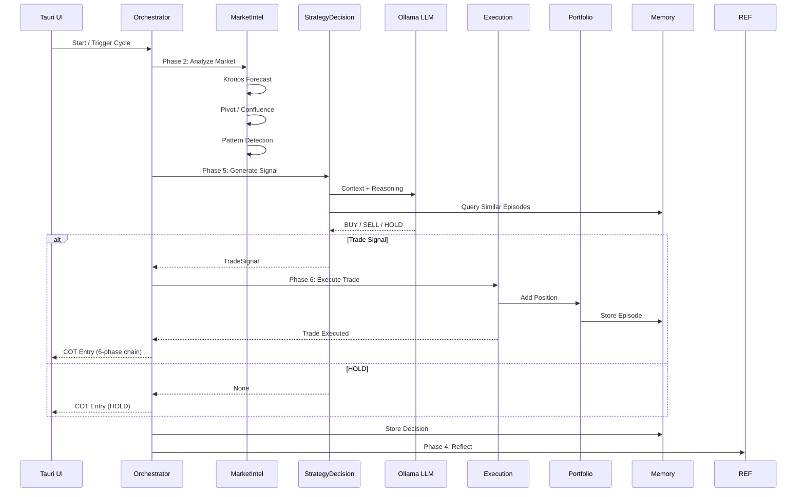

# ⚡ ATES — Autonomous Trading Execution System

> **Production-grade, Rust-first hierarchical multi-agent trading platform** for Indian markets (NSE/BSE). Enforces a rigorous **Disciplined Core** of professional trading rules while incorporating memory-driven learning and selective LLM orchestration.

[](https://www.rust-lang.org)
[](https://tokio.rs)
[](https://tauri.app)
[](LICENSE)

---

## 🏛️ System Architecture

```mermaid
graph TB
    subgraph "UI Layer [Tauri Desktop]"
        T[ATES Desktop UI]
        COT[Chain-of-Thought\nTree View]
        DASH[Dashboard\nPortfolio + P&L]
        TRAD[Trading\nChart + Order Ticket]
        AI[AI Results\nTimeline + Reflections]
    end

    subgraph "Orchestration Layer [ates-orchestrator]"
        FAST[Fast Loop\n5s: Price + SL/TP]
        MED[Medium Loop\n5m: Full Pipeline]
        SLOW[Slow Loop\n24h: Reflection]
        ORCH[AutonomousOrchestrator]
    end

    subgraph "Agent Layer (Tredo Groups) [ates-autonomous]"
        subgraph "Identifier [Scanning & Context]"
            MI[MarketIntelligenceAgent]
            WS[WatchlistScannerAgent]
            PC[PivotCalculatorAgent]
            CS[ConfluenceScorerAgent]
            PR[PatternRetrieverAgent]
            ST[SessionTimerAgent]
            RFC[RedFolderCheckerAgent]
        end

        subgraph "Verifier [Risk & Psych Validation]"
            RP[RiskPsychologyAgent]
            RC[RiskCalculatorAgent]
            REF[ReflectorAgent]
        end

        subgraph "Executer [Trade Generation]"
            SD[StrategyDecisionAgent]
            PM[PortfolioManagerAgent]
            EXEC[ExecutionCoordinatorAgent]
        end

        subgraph "Guardian [Account Safeguards]"
            DM[DrawdownMonitorAgent]
            OP[OvertradingPreventerAgent]
            OL[OutcomeLoggerAgent]
        end
        MC[MetaControlAgent\nRule Adjustment]
    end

    subgraph "Core Layer [ates-core]"
        DC[DisciplinedCore\nRule Enforcement]
        MEM[Memory Store\nredb + Vector Memory]
        LLM[LLM Executor\nOllama Integration]
        KRON[Kronos Client\nForecast Service]
        PAT[Candlestick Patterns\n15 Detectors]
    end

    subgraph "External Services"
        BINANCE[Binance WebSocket\nCrypto Prices]
        YAHOO[Yahoo Finance\nIndian Stocks]
        OLLAMA[Ollama LLM\nministral-3]
        KRONSVC[Kronos Service\nTime Series Forecast]
        TV[TradingView\nChart Widget]
    end

    T --> ORCH
    ORCH --> FAST & MED & SLOW
    FAST --> BINANCE & YAHOO
    MED --> MI & SD & RP
    SLOW --> REF & MC
    
    MI --> PC & CS & ST & PAT
    SD --> LLM & PR
    RP --> DM & RFC & OP
    PM --> MEM
    EXEC --> DC
    MC --> DC
    
    KRON --> KRONSVC
    LLM --> OLLAMA
    T --> TV
    T --> COT & DASH & TRAD & AI
    COT --> ORCH
```



---

## 🧭 Data Flow



---

## 🎯 Core Philosophy

```
Rules + Memory > Pure Prompting
```

| Principle | Description |
|-----------|-------------|
| **Two-Tier Architecture** | Main Agents (LLM-capable) coordinate; Sub-Agents are deterministic and pure logic |
| **Disciplined Core First** | Non-negotiable trading rules enforced before any LLM call |
| **Selective LLM Usage** | LLM is a scarce resource — only used for high-uncertainty or complex synthesis |
| **Memory-Driven Learning** | Episodic memory + vector similarity + meta-control for continuous improvement |
| **Observability** | Full chain-of-thought tree, real-time dashboard, Tauri desktop UI |

---

## 🚀 Quick Start

```bash
# 1. Run all tests
cargo test -p ates-core -p ates-autonomous

# 2. Run backend orchestrator
cargo run -p ates-orchestrator

# 3. Run with Tauri desktop UI (recommended)
cd src-tauri && cargo tauri dev

# 4. Production build
cargo build --release -p ates-ui
# Or via Docker
docker build -t ates . && docker run -it ates
```

### 🔧 Prerequisites

| Dependency | Version | Purpose |
|------------|---------|---------|
| Rust | 1.75+ | Core language |
| Ollama | Latest | LLM inference (ministral-3) |
| Python 3 | 3.10+ | Kronos forecasting service |
| Node.js | 18+ | Tauri frontend tooling |

---

## 📦 Technology Stack


| Layer | Technology | Purpose |
|-------|-----------|---------|
| **Core Language** | Rust + Tokio | Async, safe, performant trading engine |
| **State & KV** | redb | Embedded key-value store for memory |
| **Vector Memory** | LanceDB | Semantic similarity for episode retrieval |
| **LLM** | Ollama (ministral-3) | Selective reasoning + reflection |
| **Forecast** | Kronos (Python) | Time-series price prediction |
| **UI** | Tauri 2 + Vanilla JS | Native desktop SPA with 5 pages |
| **Charting** | TradingView / Canvas | Real-time market visualization |

---

## 🗂️ Project Structure

```
ATES/
├── crates/
│   ├── ates-core/              # Foundation layer
│   │   └── src/
│   │       ├── disciplined_core.rs   # Rule enforcement engine
│   │       ├── memory.rs             # redb + vector store
│   │       ├── llm.rs               # Ollama executor
│   │       ├── kronos_client.rs      # Forecast service client
│   │       ├── patterns.rs           # 15 candlestick detectors
│   │       ├── execution.rs          # Paper trading engine
│   │       └── backtest.rs           # Historical simulation
│   ├── ates-autonomous/         # Agent intelligence layer
│   │   └── src/
│   │       ├── orchestrator_struct.rs    # Agent composition
│   │       ├── orchestrator_pipeline.rs  # 6-phase pipeline
│   │       ├── market_intelligence.rs    # Kronos + confluence
│   │       ├── strategy_decision.rs      # LLM signal generation
│   │       ├── risk_psychology.rs        # Drawdown + heat checks
│   │       ├── reflector.rs              # Post-trade reflection
│   │       ├── portfolio_manager.rs      # Position accounting
│   │       ├── execution_coordinator.rs  # Paper trade execution
│   │       ├── meta_control.rs           # Rule auto-adjustment
│   │       ├── backtester.rs             # Agent-driven backtest
│   │       └── types.rs                  # Shared type definitions
│   └── ates-orchestrator/        # System orchestration
│       └── src/
│           ├── main.rs                 # Entry point
│           └── loops.rs                # Fast/Medium/Slow loops
├── src-tauri/                  # Desktop UI
│   └── frontend/
│       ├── index.html           # 5-page SPA
│       ├── style.css            # Dark theme stylesheet
│       └── app.js               # ATES namespace + COT tree
├── kronos_service/              # Python forecast service
├── docs/                        # Architecture documentation
└── Dockerfile                   # Production build
```

---

## 🧪 Testing

```bash
# Core library (31 tests)
cargo test -p ates-core

# Autonomous agents (1 test)
cargo test -p ates-autonomous

# All tests
cargo test --workspace

# Backend build (zero warnings)
cargo build -p ates-core -p ates-autonomous -p ates-orchestrator
```

---

## ⚠️ Disclaimer

ATES is a **research and educational prototype**. It is **not financial advice**.

- Dummy API keys are in `crates/ates-core/src/config.rs` — **replace before any live/paper trading**
- Extensive paper trading validation is required before real capital use
- Never commit real API keys — use environment variables or secure secret management in production

---

## 📚 Documentation

| Document | Description |
|----------|-------------|
| [Agent Architecture](docs/AGENT_DESIGN.md) | Two-tier agent hierarchy and decision flow |
| [Disciplined Core](docs/DISCIPLINED_CORE.md) | Rule enforcement engine specification |
| [v2 Architecture](docs/AGENTIC_ARCHITECTURE_V2.md) | Temporal loops, memory, debate pipeline |
| [Low-Resource Design](docs/ATES_LOW_RESOURCE_ARCHITECTURE.md) | 8GB RAM optimization strategy |
| [Roadmap](docs/ROADMAP.md) | Development phases and progress |
| [Kronos Service](kronos_service/README.md) | Time-series forecast microservice |
